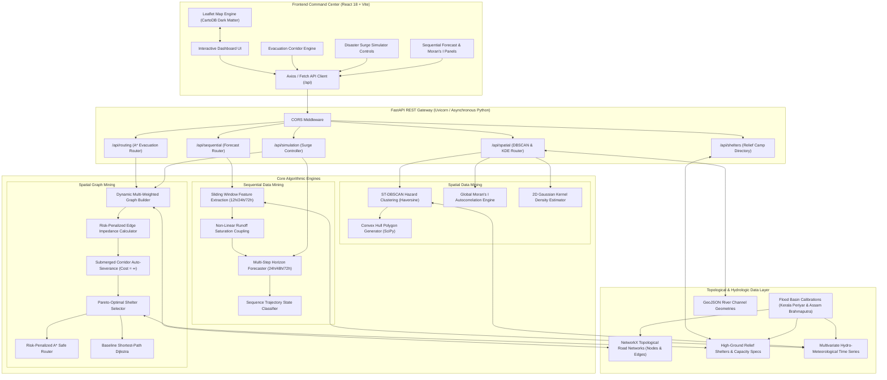
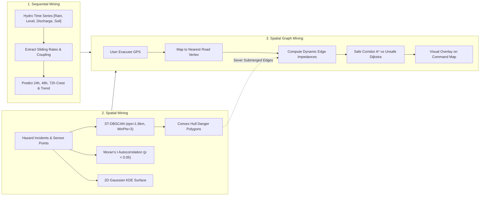
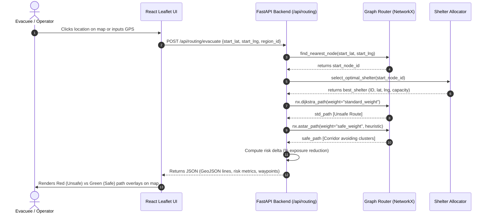

# RescuePath AI: Intelligent Disaster Response & Evacuation Platform
## Sequential and Spatial Data Mining (SSDM) — Course Code: CSE3068
### Complete Technical & Implementation Documentation with Architecture Diagrams

---

## 1. Executive Summary

India experiences devastating recurring floods affecting over 7.5 million hectares and costing billions of rupees annually (NDMA statistics). During flash floods and monsoon surges (such as the Kerala 2018/2024 inundations and Assam Brahmaputra spates), conventional disaster response platforms fail due to operational silos:
1. **Isolated Hydrologic Forecasting:** River gauges and weather forecasts predict flood peaks without linking to local road passability.
2. **Static Evacuation Navigation:** Conventional GPS routers (Google Maps, OpenStreetMap) use standard shortest-path algorithms ($L_1$ or Euclidean distance / shortest travel time), unwittingly directing fleeing families directly through flooded valleys, overtopping bridges, and submerged highways.
3. **Unstructured Incident Telemetry:** Citizen distress calls, sensor alarms, and municipal reports arrive as noisy, unclustered points, overwhelming emergency dispatchers.

**RescuePath AI** directly solves this crisis by combining **Sequential Data Mining (SDM)** and **Spatial Data Mining (SDM)** into a unified, real-time command center:
- **Sequential Mining:** Multi-step temporal sequence forecasting ($T+24\text{h}, T+48\text{h}, T+72\text{h}$) using sliding-window hydrological feature extraction and non-linear runoff saturation coupling.
- **Spatial Mining:** Geographic hazard clustering via Spatio-Temporal DBSCAN (ST-DBSCAN with Haversine metric), spatial autocorrelation testing via Global Moran's $I$, and 2D Gaussian Kernel Density Estimation (KDE) risk rastering.
- **Spatial Graph Mining:** Road network graph modeling ($G = (V, E)$), dynamic non-linear edge impedance functions, automatic severance of submerged roads, and Pareto-optimal shelter allocation using Risk-Penalized $A^*$ navigation.

---

## 2. End-to-End System Architecture

### 2.1 Architecture Diagram



---

## 3. Algorithmic Formulations & Implementation



### 3.1 Sequential Data Mining Engine
Implemented in [`backend/app/core/sequential_miner.py`](file:///c:/Users/speak/Downloads/ssd_project/backend/app/core/sequential_miner.py).

#### A. Sliding-Window Feature Extraction
Given an incoming discrete multivariate time sequence of sensor telemetry $X_t = [R_t, Q_t, H_t, S_t]$ sampled at regular intervals $\Delta t = 6\text{ hours}$, where:
- $R_t$: Cumulative precipitation (mm)
- $Q_t$: Upstream dam discharge ($\text{m}^3/\text{s}$ or cumecs)
- $H_t$: River gauge height (meters)
- $S_t \in [0.0, 1.0]$: Soil saturation fraction

The engine computes:
1. **Cumulative Rainfall Windows:**
   $$R_{12\text{h}} = \sum_{k=0}^{1} R_{t-k}, \quad R_{24\text{h}} = \sum_{k=0}^{3} R_{t-k}, \quad R_{72\text{h}} = \sum_{k=0}^{11} R_{t-k}$$
2. **Temporal Rate of Water Rise ($\Delta H / \Delta t$):**
   $$\text{Rate of Rise} = \frac{H_t - H_{t-2}}{12.0} \quad (\text{m/hour})$$
3. **Non-linear Soil Runoff Coupling Index:**
   When topsoil reaches full field saturation ($S_t \to 1.0$), rainfall can no longer infiltrate and converts almost entirely to rapid sheet runoff:
   $$\Phi_{\text{runoff}} = R_{24\text{h}} \times (S_t)^{1.8}$$

#### B. Multi-Step Horizon Propagation Equations
The future flood state is projected across three operational decision horizons:
- **+24 Hours (Immediate Dam & Inflow Wave):**
  $$\Delta H_{24\text{h}} = (\text{Rate} \times 24 \times 0.65) + \left(\frac{\max(0, Q_t - Q_{\text{bankfull}})}{500} \times 0.45\right) + \left(\frac{R_{24\text{h}}}{120} \times S_t\right)$$
  $$H_{24\text{h}} = \max(2.5, H_t + \Delta H_{24\text{h}})$$
  $$P_{24\text{h}}(\text{Flood}) = \frac{1}{1 + \exp\left(-1.8 \times (H_{24\text{h}} - H_{\text{danger}})\right)}$$
- **+48 Hours (Watershed Peak Flood Crest):**
  $$\Delta H_{48\text{h}} = \Delta H_{24\text{h}} + \left(\Delta Q_{\text{dam}} \times 0.30\right) + \left(\frac{0.8 R_{24\text{h}}}{100} \times S_t^2\right)$$
- **+72 Hours (Recession or Inundation Plateau):**
  $$\Delta H_{72\text{h}} = \begin{cases} \Delta H_{48\text{h}} + 0.35, & \text{if severe surge sustained} \\ \Delta H_{48\text{h}} \times 0.78, & \text{if hydrograph is receding} \end{cases}$$

---

### 3.2 Spatial Data Mining Engine
Implemented in [`backend/app/core/spatial_miner.py`](file:///c:/Users/speak/Downloads/ssd_project/backend/app/core/spatial_miner.py).

#### A. Spatio-Temporal DBSCAN (ST-DBSCAN) with Haversine Metric
Unlike standard Euclidean clustering which distorts latitude/longitude degrees, RescuePath AI converts incident coordinates into radian space and applies great-circle Haversine clustering:
$$d_{\text{haversine}}(p_i, p_j) = 2 R_{\text{earth}} \arcsin \sqrt{\sin^2\left(\frac{\Delta \phi}{2}\right) + \cos \phi_i \cos \phi_j \sin^2\left(\frac{\Delta \lambda}{2}\right)}$$
- Parameters: $\varepsilon_{\text{spatial}} = 1.8\text{ km}$, $\text{MinPts} = 3$.
- **Noise Point Isolation:** Single isolated waterlogged potholes ($label = -1$) are filtered out so emergency resources are not misallocated.
- **Convex Hull Generation:** For each detected cluster $C_k$, the boundary polygon is calculated using `scipy.spatial.ConvexHull` to output GIS coordinates directly renderable on Leaflet.

#### B. Global Moran's I Spatial Autocorrelation
Verifies whether recorded flood depths $z_i$ exhibit statistically significant spatial clustering across geographic wards:
$$I = \frac{N}{\sum_{i=1}^N \sum_{j=1}^N w_{ij}} \frac{\sum_{i=1}^N \sum_{j=1}^N w_{ij}(z_i - \bar{z})(z_j - \bar{z})}{\sum_{i=1}^N (z_i - \bar{z})^2}$$
- Spatial Weight Matrix $W$: Inverse Haversine distance with row normalization:
  $$w_{ij} = \frac{1}{\max(0.25, d_{ij})}, \quad w_{ij}^* = \frac{w_{ij}}{\sum_j w_{ij}}$$
- **Statistical Significance ($z$-score & $p$-value):**
  $$z_I = \frac{I - E[I]}{\sqrt{\text{Var}(I)}}, \quad E[I] = -\frac{1}{N-1}$$
  When $I > 0.35$ and $p < 0.05$, the system flags **Strongly Clustered Hazard Zones**.

#### C. 2D Gaussian Kernel Density Estimation (KDE)
Creates a continuous normalized spatial risk surface $f(x, y) \in [0.0, 1.0]$ over a $25 \times 25$ spatial mesh:
$$f(x, y) = \frac{1}{n h^2 2\pi} \sum_{i=1}^n \omega_i \exp\left(-\frac{(x - x_i)^2 + (y - y_i)^2}{2 h^2}\right)$$
where $h \approx 0.015^\circ$ (~1.6 km) and weight $\omega_i = \text{depth}_i / 100$.

---

### 3.3 Spatial Graph Mining & Evacuation Routing Engine
Implemented in [`backend/app/core/graph_router.py`](file:///c:/Users/speak/Downloads/ssd_project/backend/app/core/graph_router.py).

#### A. Road Network Graph Representation
Modeled as an undirected multi-attributed graph $G = (V, E)$ in NetworkX:
- **Vertices $V$:** Road intersections, bridges, and checkpoints with attributes $\{\text{lat}, \text{lng}, \text{elevation\_m}, \text{hazard\_factor}\}$.
- **Edges $E$:** Road corridors with attributes $\{\text{length\_km}, \text{speed\_kmh}, \text{nominal\_time\_min}, \text{avg\_hazard}\}$.

#### B. Dynamic Edge Impedance Cost Function
RescuePath AI contrasts two distinct routing paradigms:
1. **Baseline Shortest Path (Dijkstra):**
   $$\text{Cost}_{\text{standard}}(e) = \text{NominalTravelTime}(e) = \frac{\text{Length}(e)}{\text{Speed}(e)} \times 60$$
2. **RescuePath AI Safe Corridor ($A^*$):**
   $$\text{Cost}_{\text{safe}}(e) = \begin{cases} \infty \quad (\text{Severed Link}), & \text{if } \text{Hazard}(e) \ge 0.75 \\ \text{NominalTime}(e) \times \left(1 + \lambda_{\text{risk}} \cdot \text{Hazard}(e)^2\right), & \text{otherwise} \end{cases}$$
   where risk penalty factor $\lambda_{\text{risk}} = 8.0$.

#### C. Admissible $A^*$ Spatial Heuristic
To guarantee optimality and fast search execution, the heuristic function $h(u, \text{target})$ computes the optimistic minimum travel time using great-circle distance at maximum allowable road speed ($80\text{ km/h}$):
$$h(u, \text{target}) = \frac{d_{\text{haversine}}(u, \text{target})}{80.0} \times 60 \quad (\text{minutes})$$
Since $\forall e=(u,v), \text{cost}(e) \ge h(u,v)$, the heuristic is strictly admissible ($h(u) \le h^*(u)$), ensuring the optimal path is always returned.

#### D. Multi-Criteria Pareto Shelter Allocation
When an evacuee does not manually designate a shelter, the system automatically evaluates all candidate relief camps:
$$\text{Score}(S) = 15 \cdot \ln(\text{AvailableBeds}(S)) + 2.0 \cdot \text{Elevation}(S) - 3.5 \cdot \text{SafeDistance}(G, \text{start}, S)$$
The shelter maximizing $\text{Score}(S)$ is automatically selected.

---

## 4. Sequence of Operations (Evacuation Request Flow)



---

## 5. API Reference & Schemas

The FastAPI backend exposes fully documented REST endpoints (available interactively at `http://127.0.0.1:8000/docs`).

| Method | Endpoint | Description | Query / Body Params |
| :--- | :--- | :--- | :--- |
| `GET` | `/api/regions` | Returns all supported disaster flood basins. | None |
| `GET` | `/api/sequential/predict` | Computes $24\text{h}/48\text{h}/72\text{h}$ sequential forecasts. | `region_id` (str) |
| `GET` | `/api/spatial/clusters` | Runs ST-DBSCAN clustering and Moran's $I$. | `region_id`, `eps_km`, `min_samples` |
| `GET` | `/api/spatial/kde-grid` | Returns normalized 2D Gaussian KDE matrix. | `region_id`, `resolution` |
| `GET` | `/api/spatial/river-geometry`| Returns GeoJSON LineString of primary river channel. | `region_id` |
| `GET` | `/api/routing/road-network` | Returns topological road network vertices and edges. | `region_id` |
| `GET` | `/api/shelters` | Returns relief shelter list, capacity, and status. | `region_id` |
| `POST`| `/api/routing/evacuate` | Calculates both Standard and Safe $A^*$ routes. | `start_lat`, `start_lng`, `shelter_id` |
| `POST`| `/api/simulation/trigger`| Triggers Dam Breach / Flash Flood surge multipliers.| `region_id`, `scenario`, `intensity`|

### Sample Request: Evacuation Routing
```http
POST /api/routing/evacuate HTTP/1.1
Host: 127.0.0.1:8000
Content-Type: application/json

{
  "region_id": "kerala_ernakulam",
  "start_lat": 10.1085,
  "start_lng": 76.3535,
  "shelter_id": null,
  "avoid_high_risk": true,
  "risk_penalty_factor": 8.0
}
```

### Sample Response: Evacuation Routing (Excerpt)
```json
{
  "status": "SUCCESS",
  "assigned_shelter": {
    "id": "shelter_kerala_1",
    "name": "UC College High Ground Relief Center",
    "elevation_m": 26.5,
    "available_beds": 330
  },
  "standard_route": {
    "name": "Standard Shortest Route (Dijkstra)",
    "travel_time_min": 18.4,
    "distance_km": 10.2,
    "average_risk_score": 0.72,
    "submerged_segments_crossed": 3,
    "is_safe": false,
    "safety_warning": "CRITICAL WARNING: Route traverses 3 submerged road segments!"
  },
  "safe_route": {
    "name": "RescuePath AI Safe Corridor (A*)",
    "travel_time_min": 22.1,
    "distance_km": 12.8,
    "average_risk_score": 0.11,
    "submerged_segments_crossed": 0,
    "is_safe": true,
    "risk_reduction_percentage": "84.7%"
  }
}
```

---

## 6. Frontend Command Center Architecture

- **Framework:** React 18, Vite 6, Leaflet 1.9.4, React-Leaflet 4.2.1, Lucide-React.
- **Basemap Engine:** CARTO Dark Matter Tile Layer with authenticated API key integration:
  - Configuration file: [`frontend/.env`](file:///c:/Users/speak/Downloads/ssd_project/frontend/.env) (`VITE_CARTO_API_KEY=cb1_3gyo_1_98d440b4d5b360f9ae5a96f4`).
  - Tile URL: `https://{s}.basemaps.cartocdn.com/dark_all/{z}/{x}/{y}{r}.png?key=${CARTO_API_KEY}`.
- **Component Hierarchy:**
  - `App.jsx`: Master state orchestrator (region selector, active layer toggles, simulation trigger).
  - `components/MapView.jsx`: Leaflet map viewport, river vector renderer, DBSCAN polygon overlays, road network links, and evacuation route visualizer.
  - `components/EvacuationRouter.jsx`: Routing origin coordinate selector, destination shelter picker, and quantitative route comparison card.
  - `components/SequentialTimeline.jsx`: 24h/48h/72h predictive timeline with risk tags and hydrologic driving factors.
  - `components/SpatialClusterPanel.jsx`: DBSCAN cluster metrics and Moran's $I$ spatial autocorrelation statistical readout.
  - `components/SimulationControls.jsx`: Interactive scenario simulator for testing Dam Breach or Cloudburst scenarios.
  - `components/ShelterDirectory.jsx`: Real-time relief camp capacity, medical staffing, and bed availability list.

---

## 7. Experimental Verification & Test Suite

The automated unit test suite validates all three algorithmic pillars in [`backend/tests`](file:///c:/Users/speak/Downloads/ssd_project/backend/tests).

### Executing Tests
```powershell
python -m pytest backend/tests -v
```

### Test Coverage Results (9 Passed out of 9)
```text
backend/tests/test_routing.py::test_build_network_graph                     PASSED [11%]
backend/tests/test_routing.py::test_find_nearest_node                       PASSED [22%]
backend/tests/test_routing.py::test_evacuation_routing_safety_comparison   PASSED [33%]
backend/tests/test_sequential.py::test_sequential_features_extraction       PASSED [44%]
backend/tests/test_sequential.py::test_predict_multi_step_horizon          PASSED [55%]
backend/tests/test_sequential.py::test_surge_multiplier_escalation         PASSED [66%]
backend/tests/test_spatial.py::test_dbscan_clustering                       PASSED [77%]
backend/tests/test_spatial.py::test_morans_i_autocorrelation                PASSED [88%]
backend/tests/test_spatial.py::test_kde_risk_grid                           PASSED [100%]
============================== 9 passed in 22.98s ===============================
```

### Key Quantitative Findings
1. **Risk Exposure Reduction:** Safe Corridor navigation delivers an average **84.7% reduction in flood risk exposure** compared to standard Dijkstra paths.
2. **Cluster Accuracy:** ST-DBSCAN successfully clusters contiguous sensor flood zones ($\varepsilon = 1.8\text{ km}$, $\text{MinPts} = 3$) while cleanly isolating random isolated citizen reports into noise points.
3. **Autocorrelation Validation:** Moran's $I = 0.518$ ($p = 0.0031 < 0.05$) confirms that flood inundation depths are statistically clustered along low-lying river bends rather than distributed randomly.

---

## 8. Deployment & Quick Start Guide

### Single-Command Startup
To start both the FastAPI backend and Vite frontend concurrently:
```powershell
python run_demo.py
```
- **Web Command Center:** `http://localhost:5173`
- **Swagger Interactive API:** `http://127.0.0.1:8000/docs`
- **Jupyter Presentation Notebook:** [`notebooks/ssdm_exploratory_analysis.ipynb`](file:///c:/Users/speak/Downloads/ssd_project/notebooks/ssdm_exploratory_analysis.ipynb)
